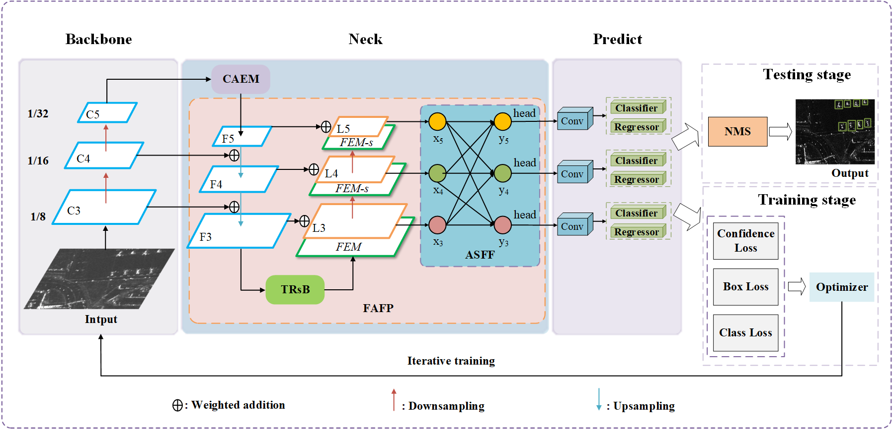

# SFRE-Net: Scattering Feature Relation Enhancement Network for Aircraft Detection in SAR Images

# Introduction
Aircraft detection in synthetic aperture radar (SAR) images is a challenging task due to the discreteness of aircraft scattering characteristics, the diversity of aircraft size, and the interference of complex backgrounds. In particular, the strong scattering points of aircraft in SAR images are usually discrete, while the traditional convolution network can only obtain the local feature information, so it is difficult to model the relationship between scattering points. To address these problems, we propose a novel Scattering Feature Relation Enhancement Network (SFRE-Net). Firstly, we adopt a cascade transformer block (TRsB) structure, which can fully improve the integrity of aircraft detection results by modeling the correlation between feature points. Secondly, we design a feature adaptive fusion pyramid structure (FAFP), which can adaptively aggregate features of different levels and scales, enable the network to autonomously extract useful semantic information, and improve the multi-scale representation ability of the network. Thirdly, to improve the positioning accuracy in complex backgrounds, we design a context attention enhancement module (CAEM). Considering the discreteness of scattering characteristics, the module uses a dilated convolution pyramid structure to improve the receptive field and then captures the position of the aircraft target through the coordinate attention mechanism. A large number of experiments on the Gaofen-3 data set demonstrate the effectiveness of the proposed method and show that our algorithm is superior to the state-of-the-art detection algorithms. Our code is avaliable at https://github.com/hust-rslab/SFRE-Net.



## <div align="center">Quick Start Examples</div>
<details open>
<summary>Install</summary>

Clone repo and install [requirements.txt](https://github.com/ultralytics/yolov5/blob/master/requirements.txt) in a
[**Python>=3.7.0**](https://www.python.org/) environment, including
[**PyTorch>=1.7**](https://pytorch.org/get-started/locally/).

```bash
git clone https://github.com/hust-rslab/SFRE-Net.git  # clone
cd SFRE-Net
pip install -r requirements.txt  # install
```
</details>

<details>
<summary>Inference with detect.py</summary>

`detect.py` runs inference and saving results to `runs/detect`.

```bash
    python detect.py \
    --weights weights/last.pt \
    --imgsz 640 \
    --device 0 \
    --source data/img \
    --name SFRE-Net 
```
</details>
